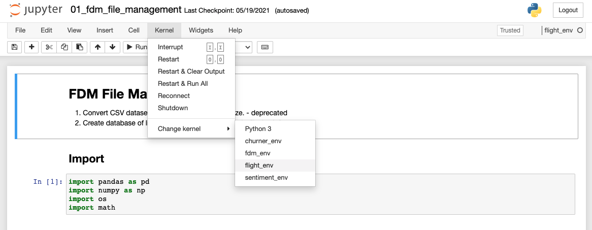

# Flight Analyzer

Analyze Flight Data Manager (FDM) for unstable approach landing and energy.
## How to Install Requirements on Conda

1. Create a Conda environment.

    ```bash
    conda create --name flight_env
    ```

2. Activate the environment using the command as shown in the console.

    ```bash
    conda activate flight_env
    ```

3. Install your dependencies: 

    ```bash
    conda install --file requirements.txt
    ```

You have successfully installed the environment. Next, we need to link this environment to oour jupyter notebook.

## Set Environment to Jupyter Notebook

1. Install ipykernel: 

    ```bash
    conda install -c anaconda ipykernel
    ```

2. Set our environment to our jupyter notebook

    ```bash
    python -m ipykernel install --user --name=flight_env
    ```

Done. Now, when you open the .ipynb file, change the kernel to use our new environment.

